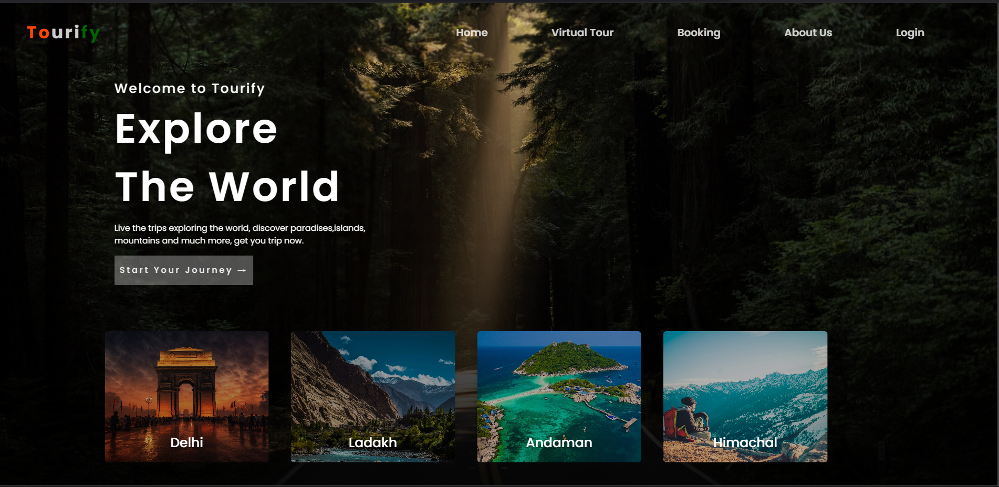

# 🌎 Tourify React App

<div align="center">
  
</div>

A comprehensive tourism platform built with React and Google API integration, offering an immersive travel planning experience with features like hotel search, virtual tours, and flight bookings.
</br>
</br>

<div align="center">
  
  
  
  
</div>

## 🌟 Features

- Interactive hotel search with Google Places API integration
- Immersive virtual tours of destinations
- Seamless flight booking interface
- Interactive travel stories sharing
- Real-time maps and location services
- Mobile-responsive design
- User-friendly booking interface

## 🚀 Getting Started

Clone the repository and install dependencies:

```bash
git clone https://github.com/YogiJi21/Tourify-React-App.git
cd Tourify-React-App
npm install
```

Start the development server:

```bash
npm start
```


## 🛠️ Built With

- [React](https://reactjs.org/) - Frontend framework
- [Google Maps API](https://developers.google.com/maps) - Maps and location services
- [Google Places API](https://developers.google.com/places) - Hotel and destination search
- [React Router](https://reactrouter.com/) - Navigation
- [Axios](https://axios-http.com/) - API requests

## 📊 Key Features Explained

### Hotel Search
- Integrated Google Places API
- Advanced filtering options
- Real-time availability checking
- Price comparison functionality

### Virtual Tours
- 360° panoramic views
- Interactive hotspots
- Destination previews
- Immersive user experience

### Flight Bookings
- Real-time flight search
- Price comparison
- Booking management
- E-ticket generation

### Travel Stories
- User-generated content
- Interactive storytelling
- Photo sharing capabilities
- Community engagement features

# Hey there! 👋 I'm Yogesh Hingorani

## 👨‍💻 About Me
- 🎓 MCA Graduate from VTU University, Bengaluru 
- 💻 Post-Graduate Developer specializing in React.js, Next.js, and TypeScript
- 🌟 Strong foundation in Python, Java, C, and C++
- 📍 Based in Gurugram, India
- 📧 Contact: yogi.hingorani21@gmail.com


## 🛠️ Tech Stack

### Languages
<div>
  
  
  
  
  
  
  
  
  
</div>

### Frontend Development
<div>
  
  
  
  
  
  
  
</div>

### Backend & Database
<div>
  
  
  
  
  
</div>

## 📊 GitHub Stats

<div align="center">
  
  <br/>
  
  <br/>
  
</div>

## 🎓 Certifications
- Full Stack Course (Johns Hopkins University, Coursera) - 2024
- Web Development Internship (Embrizon Technologies) - 2024
- Android O & Java Development Bootcamp - 2020
- Ethical Hacking Workshop - 2019

## 📫 Let's Connect!
- LinkedIn: [Yogesh Hingorani](https://linkedin.com/in/yogesh-hingorani21)
- Portfolio: [my-portfolio-next-app-five.vercel.app](https://my-portfolio-next-app-five.vercel.app/)
- Email: yogi.hingorani21@gmail.com

---

<div align="center">
  <i>⭐️ From [YogiJi21](https://github.com/YogiJi21)</i>
</div>

---

<div align="center">
  <i>Developed by Yogesh Hingorani</i>
</div>
